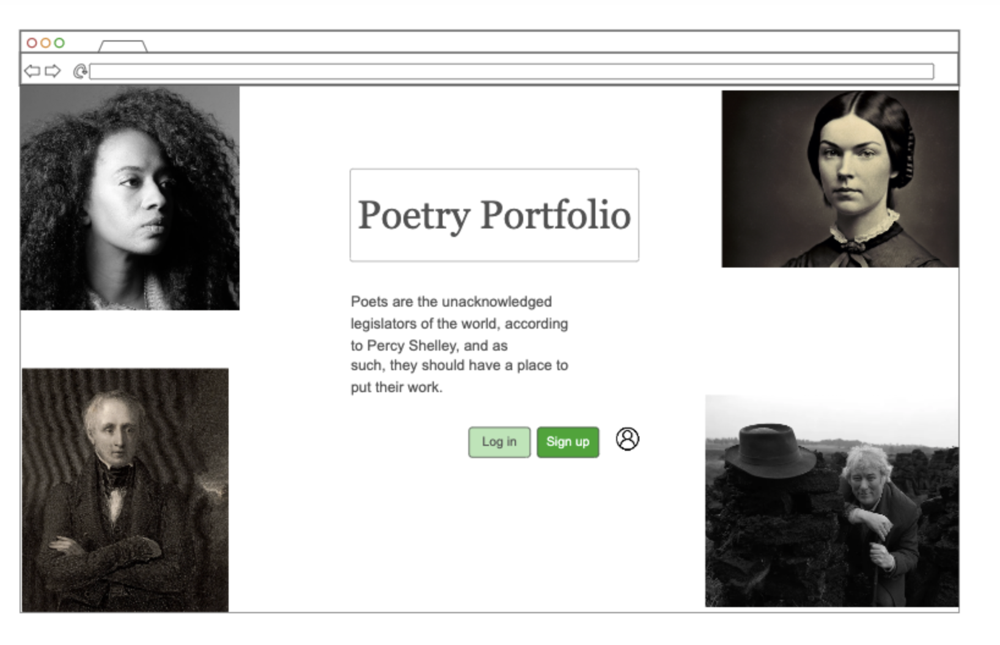
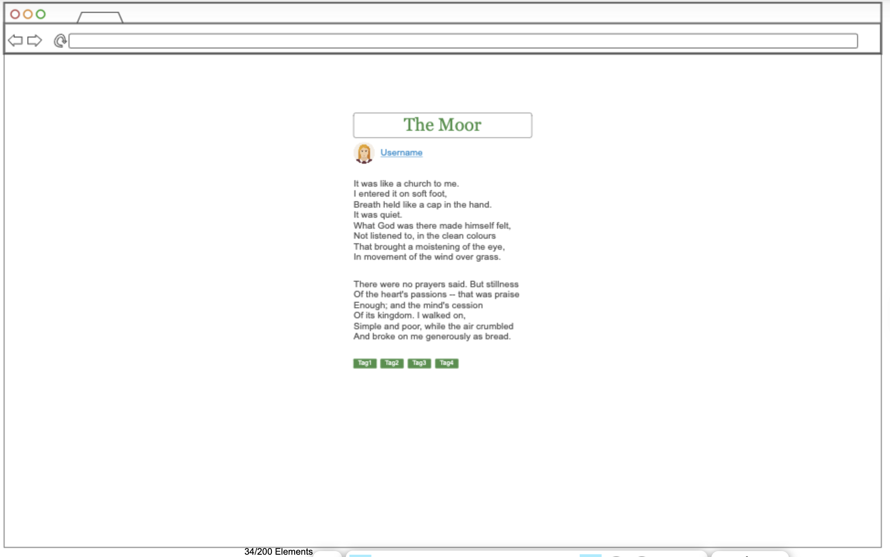

# CS260
Web development

## Poetry Portfolio Elevator Pitch

I am an English major, and many of my friends are also English majors, which has led me to the realization that most of my English-major friends do not understand technology. As slightly techno-phobic individuals, publishing and storing things they create online can be overwhelming or scary. This web application would fill a presently empty space for people to upload their own poetry to a public platform, sorted by user, simply built for easy access, easy contribution, and easy storage. Another aspect of this web app would include the option to search other people's poetry either by their tag or their profile. It could be useful in poetry classes at universities or high schools for teachers and students to read each other's works easily. 

## Poetry Portfolio Key Features

### **Sign in/login:** 
- [ ] *HTML* will structure the login page and sign-up page 
- [ ] *CSS* will style the form
- [ ] *Javascript* will handle the submission and validation
- [ ] I'll need a database to keep track of the users. (Maybe this database would be created with *SQL*.)

### **Voting/liking poems:** 
- [ ] *HTML* will be used for voting on a poem to create a like button at the end of a poem
- [ ] *CSS* would style it 
- [ ] *JavaScript/React* would handle the user interactions with the button and update the UI to reflect the current number of likes. 

### **Showing popular poems/sorting poems by tags:** 
- [ ] *HTML* would create the basic layout for displaying poems and filtering options. 
- [ ] *CSS* would style the poem listings, filters, and popular poem section. 
- [ ] *JavaScript* would fetch and display poems from the backend, handle filtering by tags, and sort poems based on popularity. 

## Poetry Portfolio Front Page Sketch

## Poetry Portfolio Poem on Page Sketch

This is very rough, and I will be brainstorming how to make it prettier. I was thinking if you clicked on the person's username it would take you to a collection of their stuff. They'd have the option to organize it and put it into folders, or they could just have all of their poems be buttons.

## HTML Deliverable
For this deliverable, I built out the structure of my website using HTML.
- [x] **HTML pages** - Eight HTML pages that represent the ability to login, search, view a profile, view folders (4), and learn about the site. 
- [x] **Links** - The login page automatically links to the search page. The search page contains links to the about page and to your profile, which contains links to the folders.
- [x] **Text** - There is quite a bit of text. For example, on the login page, I included quotes from famous poets about why poetry is important.
- [X] **Images** - I included 6 images of poets on the login page. I think it could also be cool to have profile pictures on the profile page, but I'm not sure how to do that.
- [x] **DB/Login** - Input box and submit button for login. 
- [x] **WebSocket** - The count of likes a poem gets from certified accounts represents the tally of realtime votes.
